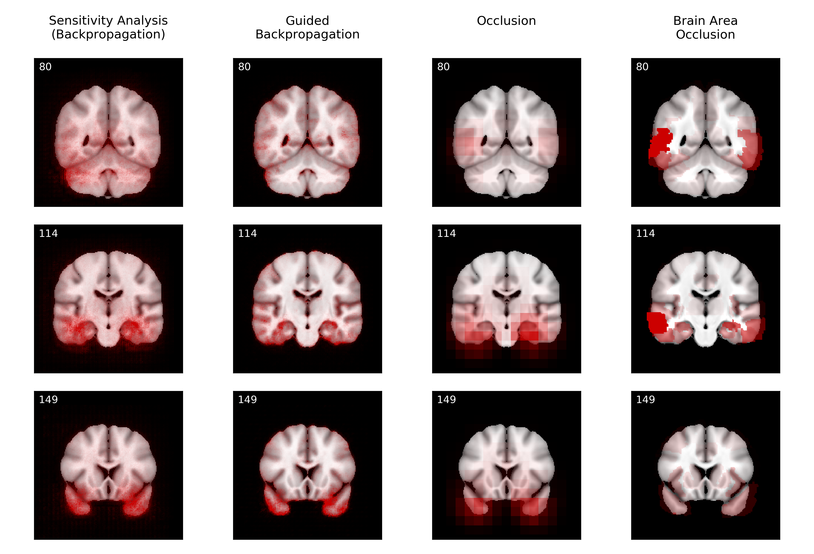

# Visualizing Convolutional Networks for MRI-based Diagnosis of Alzheimer’s Disease

**Johannes Rieke, Fabian Eitel, Martin Weygandt, John-Dylan Haynes and Kerstin Ritter**

Our paper will be presented at [MLCN 2018](https://mlcn2018.com/).

**Preprint:** TODO

**Abstract:** Visualizing and interpreting convolutional neural networks (CNNs) is an important task to increase trust in automatic medical decision making systems. In this study, we train a 3D CNN to detect Alzheimer’s disease based on structural MRI scans of the brain. Then, we apply four different gradient-based and occlusion-based visualization methods that explain the network’s classification decisions by highlight- ing relevant areas in the input image. We compare the methods qualita- tively and quantitatively. We find that all four methods focus on brain regions known to be involved in Alzheimer’s disease, such as inferior and middle temporal gyrus. While the occlusion-based methods focus more on specific regions, the gradient-based methods pick up distributed rel- evance patterns. Additionally, we find that the distribution of relevance varies across patients, with some having a stronger focus on the temporal lobe, whereas for others more cortical areas are relevant. In summary, we show that applying different visualization methods is important to understand the decisions of a CNN, a step that is crucial to increase clinical impact and trust in computer-based decision support systems.

## Code Structure

The codebase uses PyTorch and Jupyter notebooks. The main files for the paper are:

- `training.ipynb` is the notebook to train the model and perform cross validation.
- `interpretation-mri.ipynb` contains the code to create relevance heatmaps with different visualization methods. It also includes the code to reproduce all figures and tables from the paper.
- All `*.py` files contain methods that are imported in the notebooks above.

Additionally, there are two other notebooks:
- `interpretation-photos.ipynb` uses the same visualization methods as in the paper but applies them to 2D photos. This might be an easier introduction to the topic. 
- `small-dataset.ipynb` contains some old code to run a similar experiment on a smaller dataset.

## Data

The MRI scans used for training are from the [Alzheimer Disease Neuroimaging Initiative (ADNI)](http://adni.loni.usc.edu/). The data is free but you need to apply for access on http://adni.loni.usc.edu/. Once you have an account, go [here](http://adni.loni.usc.edu/data-samples/access-data/) and log in. 

### Tables

We included csv tables with metadata for all images we used in this repo (`data/ADNI/ADNI_tables`). These tables were made by combining several data tables from ADNI. There is one table for 1.5 Tesla scans and one for 3 Tesla scans. In the paper, we trained only on the 1.5 Tesla images. 

### Images

To download the corresponding images, log in on the ADNI page, go to "Download" -> "Image Collections" -> "Data Collections". In the box on the left, select "Other shared collections" -> "ADNI" -> "ADNI1:Annual 2 Yr 1.5T" (or the corresponding collection for 3T) and download all images. We preprocessed all images by non-linear registration to a 1 mm isotropic ICBM template via ANTs (http://stnava.github.io/ANTs/) with default parameters. 

To be consistent with the codebase, put the images into the folders `data/ADNI/ADNI_2Yr_15T_quick_preprocessed` (for the 1.5 Tesla images) or `data/ADNI/ADNI_2Yr_3T_preprocessed` (for the 3 Tesla images). Within these folders, each image should have the following path: `<PTID>/<Visit (spaces removed)>/<PTID>_<Scan.Date (/ replaced by -)>_<Visit (spaces removed)>_<Image.ID>_<DX>_Warped.nii.gz`. If you want to use a different directory structure, you need to change the method `get_image_filepath` and/or the filenames in `datasets.py`. 

### Users from Ritter/Haynes lab

If you're working in the Ritter/Haynes lab at Charité Berlin, you don't need to download any data, but simply uncomment the correct `ADNI_DIR` variable in `datasets.py`. 

## Requirements

- Python 2 (mostly compatible with Python 3 syntax, but not tested)
- Scientific packages (included with anaconda): numpy, scipy, matplotlib, pandas, jupyter, scikit-learn
- Other packages: tqdm, tabulate
- PyTorch: torch, torchvision (tested with 0.3.1, but mostly compatible with 0.4)
- torchsample: I made a custom fork of torchsample which fixes some bugs. You can download it from https://github.com/jrieke/torchsample or install directly via `pip install git+https://github.com/jrieke/torchsample`. Please use this fork instead of the original package, otherwise the code will break. 

## Non-pytorch Models
If your model is not in pytorch, but you still want to use the visualization methods, you can try to transform the model to pytorch ([overview of conversion tools](https://github.com/ysh329/deep-learning-model-convertor)).

For keras to pytorch, I can recommend [nn-transfer](https://github.com/gzuidhof/nn-transfer). If you use it, keep in mind that by default, pytorch uses channels-first format and keras channels-last format for images. Even though nn-transfer takes care of this difference for the orientation of the convolution kernels, you may still need to permute your dimensions in the pytorch model between the convolutional and fully-connected stage (for 3D images, I did `x = x.permute(0, 2, 3, 4, 1).contiguous()`). The safest bet is to switch keras to use channels-first as well, then nn-transfer should handle everything by itself.

## Citation

If you use our code, please cite our paper:

TODO